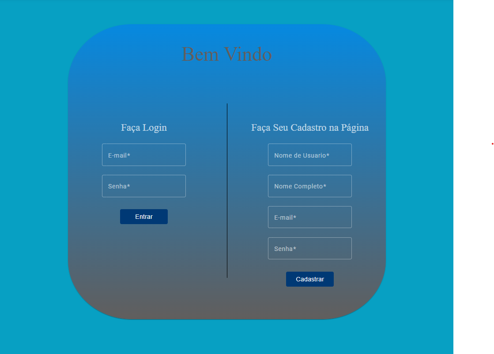
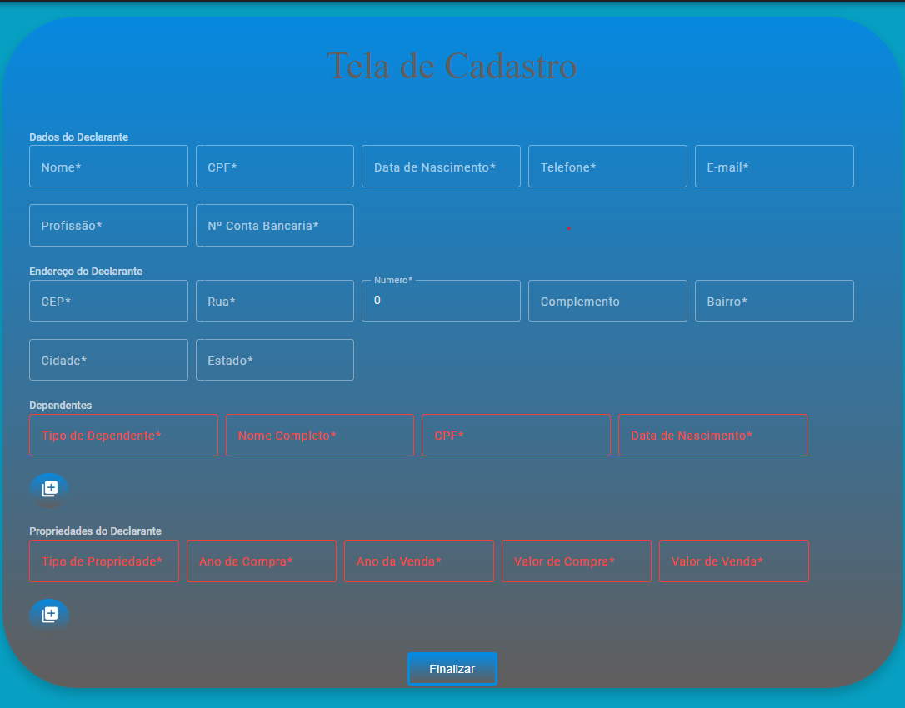
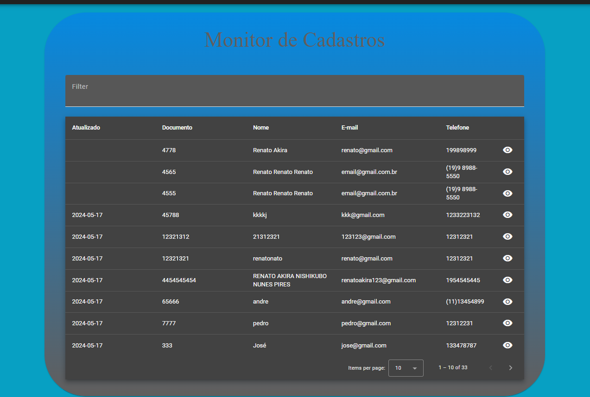
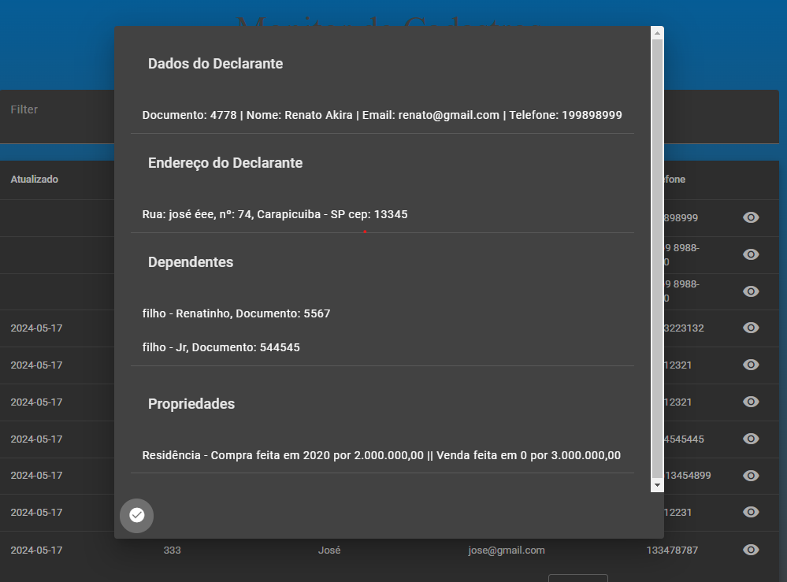

#Seu Declarador IR Online

App desenvolvido para um Projeto da Faculdade PDI 1

Curso de Engenharia da Computação 

#Introdução ao Projeto

O "Seu Declarador IR Online" é um aplicativo desenvolvido com o objetivo de facilitar o processo de registro e identificação de Declarantes de Imposto de Renda para empresas de contabilidade. Este projeto foi criado como parte da disciplina PDI 1 do curso de Engenharia da Computação e visa atender uma necessidade real encontrada no ambiente contábil: a gestão eficiente e organizada dos dados dos declarantes.

Com uma interface amigável e funcionalidades intuitivas, o aplicativo permite o cadastro, visualização e monitoramento dos declarantes, proporcionando uma experiência simplificada tanto para os usuários quanto para os profissionais de contabilidade. Embora a edição de informações dos declarantes não esteja disponível na versão atual, futuras atualizações poderão incluir essa e outras funcionalidades para tornar o sistema ainda mais robusto e versátil.

Este projeto é um passo significativo no uso da tecnologia para resolver problemas práticos do dia a dia, demonstrando o potencial dos estudantes em criar soluções inovadoras e impactantes.

#Tecnologias Utilizadas

Front-end: Angular/ Angular Material;

Back-end: Python/ Django/ Sqlite;

#Conteúdo

Para de cadastros de novo usuários da plataforma;

Para Cadastro de Novos Declarantes;

Ps: Não foi conversado sobre edição de informações, então não foi criado uma tela para atender essa demanda, pode ser adicionada futuramente, atualmente será deletado o Declarante e refeito o cadastro;

Para uma visualização rapida dos Declarantes Cadastrados;

Para uma visualização detalhada do Declarante selecionado;

#Conclusão

O "Seu Declarador IR Online" é uma solução eficaz desenvolvida para auxiliar empresas de contabilidade na gestão e identificação de Declarantes de Imposto de Renda. O projeto, concebido como parte do curso de Engenharia da Computação na disciplina PDI 1, busca simplificar o processo de registro através de uma interface intuitiva e funcional.

Embora a versão atual do aplicativo não inclua funcionalidades de edição de informações dos Declarantes, essa funcionalidade poderá ser adicionada em futuras atualizações, conforme a necessidade. Até então, o sistema permite a exclusão e recadastro dos Declarantes como uma medida temporária.
